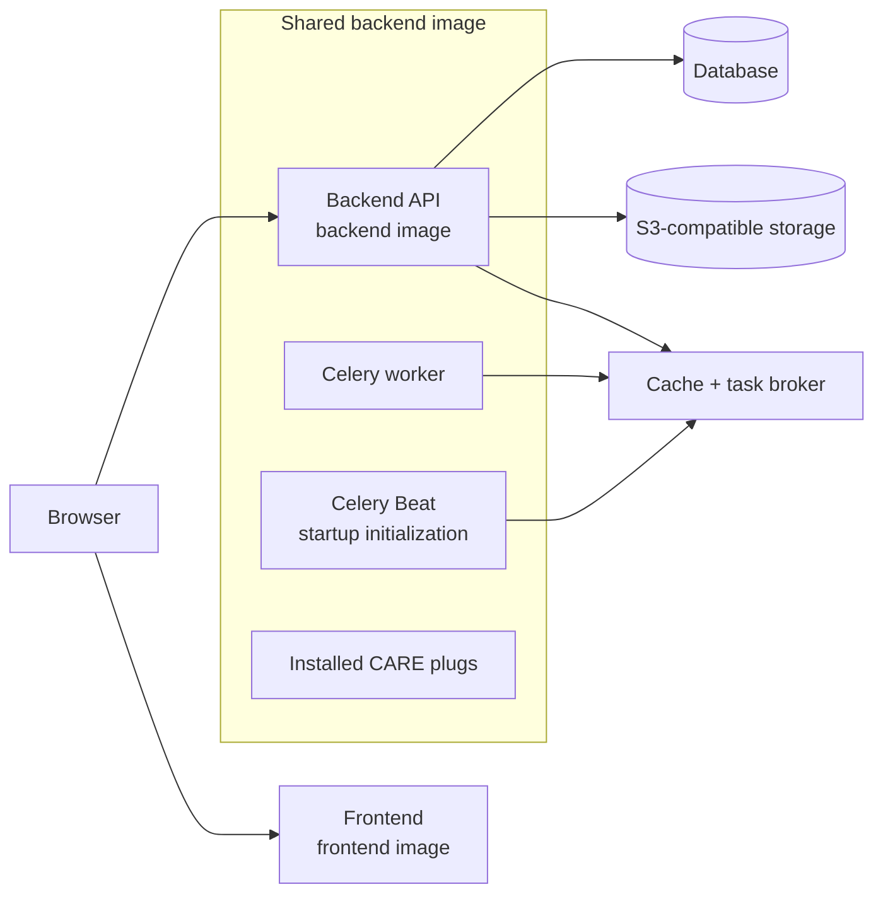

# Architecture explanation

## Component relationships

CARE's frontend is a browser application. The participant accesses it through port `4000`. The browser sends API requests directly to the backend on port `9000`.

The backend owns synchronous application logic and communicates with three dependency roles:

1. **Database** stores durable application and clinical records.
2. **Cache and task broker** provide caching and transport Celery tasks.
3. **S3-compatible storage** stores uploaded files.

The backend, worker, and Beat scheduler are built from the same CARE source and image:

- **Backend** serves HTTP API requests.
- **Worker** consumes queued tasks from the task broker.
- **Beat** runs migrations, compiles messages, synchronizes permissions and value sets, marks itself healthy, and then publishes scheduled tasks to the broker.

## Application images

CARE produces two application images:

1. The **frontend image** is built from `care_fe`. Its `REACT_*` values, including `REACT_CARE_API_URL`, are consumed during the build. The generated static files are copied into an Nginx runtime image.
2. The **backend image** is built from `care`. `ADDITIONAL_PLUGS` is passed as a build argument so the selected plug packages are downloaded and installed into the image.

Changing a frontend build variable requires a new frontend image. Changing the plug list requires a new backend image. API, worker, and Beat must use the same backend image.

## Plugs

Backend plugs are Python/Django extensions installed while the shared backend image is built. A plug can add models, API routes, and asynchronous tasks. Because it extends the application artifact, it appears inside the backend boundary rather than as an independent service.

Frontend apps can also be loaded through CARE's frontend application configuration, but they are outside the minimal backend-plug demonstration in this repository.

## Verification responsibilities

Verify that the frontend and API respond, Beat completes initialization, Django checks pass, a synthetic workflow reaches the database, a test file reaches S3-compatible storage, and queued work reaches a worker.

## Startup order

1. The database, cache and task broker, and S3-compatible storage become healthy.
2. Beat applies migrations and synchronization commands, then becomes healthy.
3. Backend and worker start from the shared CARE image.
4. Frontend starts after the backend is healthy.
5. The user opens the frontend in a browser.

This order prevents application processes from serving requests against an uninitialized database.
