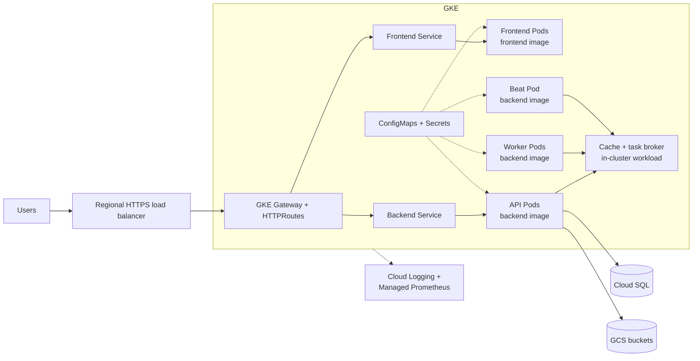

# Current OpenTofu-managed GCP architecture

This view shows the infrastructure and workloads implemented by the `gcp_template` OpenTofu and Helm repository. It is a current-state implementation view, not the recommended managed-services target.

## Local-to-GCP continuity

| Local role | Current GCP implementation |
|---|---|
| Browser access on local ports | Public DNS, regional external HTTPS load balancer, GKE Gateway, and hostname-based HTTPRoutes |
| `frontend` | CARE frontend Deployment and Service in GKE |
| `backend` | CARE API Deployment and Service in GKE |
| `worker` | Celery worker Deployment in GKE |
| `beat` | Celery Beat Deployment in GKE |
| CARE plugs | Built into the shared backend image used by API, worker, and Beat |
| Database | Private Cloud SQL with backups and point-in-time recovery |
| Cache and task broker | Helm-managed workload inside GKE |
| S3-compatible storage | CMEK-encrypted patient and facility GCS buckets |
| Local initialization | Beat performs migrations and synchronization before scheduling tasks |
| Local health and logs | Kubernetes probes, Cloud Logging, Managed Service for Prometheus, dashboard, and alert policy |
| Local environment files | Kubernetes Secrets and ConfigMaps assembled by OpenTofu from module state and variables |

## Component relationships

- Gateway and HTTPRoute resources expose the frontend, API, and optional analytics workload.
- API, worker, and Beat use the same plug-enabled backend image.
- Beat owns startup initialization; there is no separate migration or initialization workload.
- Cloud SQL and GCS provide managed durable data services.
- The cache and task broker currently run as a Helm-managed workload in GKE.
- cert-manager provisions Gateway certificates. Cloud Armor and its regional SSL policy are attached when enabled.

## Verified OpenTofu resources

The diagram includes the core resources defined by the repository:

- VPC, database and GKE subnets, Pod and Service ranges, proxy-only subnet, Cloud Router, and Cloud NAT.
- Zonal VPC-native GKE cluster with Gateway API, DNS-based control-plane access, Cloud Logging, and Managed Service for Prometheus.
- Regional static Gateway address and Gateway-managed external Application Load Balancer.
- CARE frontend, backend API, Celery worker, Celery Beat, cache and broker, Metabase, cert-manager, and CARE metrics exporter Helm workloads.
- Private Cloud SQL instances for CARE and Metabase.
- Patient and facility GCS buckets, HMAC credentials, bucket IAM, and Cloud KMS encryption keys.
- Kubernetes Secrets and ConfigMaps populated from OpenTofu state and configuration.
- CARE queue dashboard, alert policy, and optional email notification channels.

## Conditional and supporting resources

The repository also defines supporting resources. Several are controlled by feature flags or operational configuration:

- Cloud DNS managed zone.
- Regional Cloud Armor policy and TLS policy.
- GitHub Actions Workload Identity Federation and deployer service account.
- DICOM workload, database, bucket, and KMS key.
- Scribe service account and key.
- reCAPTCHA Enterprise key, which is provisioned for every environment.
- A jumphost VM, which is enabled by default unless configuration disables it.

These resources support optional capabilities or platform operations outside the core CARE runtime.

## Current implementation versus recommended target

The current implementation runs Redis inside GKE. The separate [managed-services target](gcp-managed-architecture.md) proposes Memorystore instead. That proposal is not represented as deployed OpenTofu infrastructure and requires compatibility validation and a separately tested migration.

Artifact Registry is enabled as an API and referenced by IAM permissions, but this repository does not create an Artifact Registry repository. Runtime image repository locations are supplied through Helm configuration.
