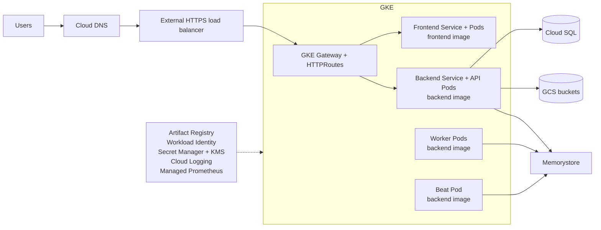

# Recommended managed-services GCP architecture

This design keeps only CARE application processes in GKE and moves durable or operational dependencies to managed GCP services.

## Design goal

The primary workload is CARE:

- CARE frontend
- CARE backend API with plugs
- Celery workers
- Celery Beat

GKE runs and scales those application processes. GCP manages the database, object storage, cache and broker, secrets, encryption, image registry, ingress, logging, and metrics.

## Edge and routing

The frontend and API have separate HTTPRoutes. TLS terminates through the Gateway listener. Cloud Armor can be attached as an optional edge policy.

## CARE workloads in GKE

| Workload | Responsibility | Scaling model |
|---|---|---|
| Frontend | Serves the CARE web application | Multiple replaceable replicas |
| Backend API | Handles synchronous API requests and plug routes | Horizontally scalable replicas |
| Celery workers | Consume asynchronous tasks | Scale independently using queue and resource signals |
| Celery Beat | Runs startup synchronization and schedules tasks | One active replica |

Backend API, workers, and Beat must use the same plug-enabled CARE image.

## Managed dependencies

| CARE dependency | Managed GCP service | Reason |
|---|---|---|
| Database | Cloud SQL over private IP | Automated backups, PITR, maintenance, replicas, and managed durability |
| S3-compatible object storage | GCS buckets | Durable patient and facility buckets with IAM, lifecycle policy, and encryption |
| Cache and Celery broker | Memorystore | Managed availability, patching, monitoring, and persistence options |
| Container images | Artifact Registry | Controlled image storage, scanning, and promotion by digest |
| Runtime secrets | Secret Manager delivered through Kubernetes Secrets | Centralized secret ownership and rotation |
| Encryption keys | Cloud KMS | Customer-managed encryption where required |
| Metrics | Managed Service for Prometheus | GKE and application metrics without a separate Prometheus control plane |
| Logs | Cloud Logging | Centralized workload, platform, and request logs |

## Networking and identity

- A VPC contains the GKE, Pod, Service, proxy-only, and private-service-access ranges.
- GKE worker nodes remain private.
- Cloud SQL and Memorystore use private addresses.
- Workload Identity grants Pods narrowly scoped GCP permissions without service-account key files.
- The backend uses a dedicated Kubernetes service account to reach GCS buckets and other permitted APIs.
- Public exposure is limited to the HTTPS load balancer and Gateway routes.

## Validate dependency choices

The diagram proposes Memorystore for the cache and task broker; it is not an automatic replacement for the local broker. Verify CARE and Celery compatibility, private connectivity, health monitoring, capacity, and a tested cutover before using a managed alternative. Likewise, test CARE's object-storage integration with GCS before choosing it.

## Optional extensions

Keep optional workloads outside the core teaching path:

- Metabase with its own managed database
- DICOM services and a dedicated GCS bucket
- CARE metrics exporter using `PodMonitoring`
- Cloud Armor policy
- External wildcard certificate support

Introduce these after participants understand the core frontend, API, task, database, cache, and storage responsibilities.

## Production checks

Before go-live, verify:

- Gateway routes, certificates, and backend health
- Workload requests, limits, probes, replicas, and disruption policies
- Cloud SQL backups, PITR, availability design, and restore test
- Memorystore sizing, availability, eviction policy, and alerting
- Bucket IAM, lifecycle policy, encryption, and recovery behavior
- Secret rotation and Workload Identity permissions
- Image digest promotion and rollback target
- Logs, metrics, alerts, runbooks, and named operational owners
