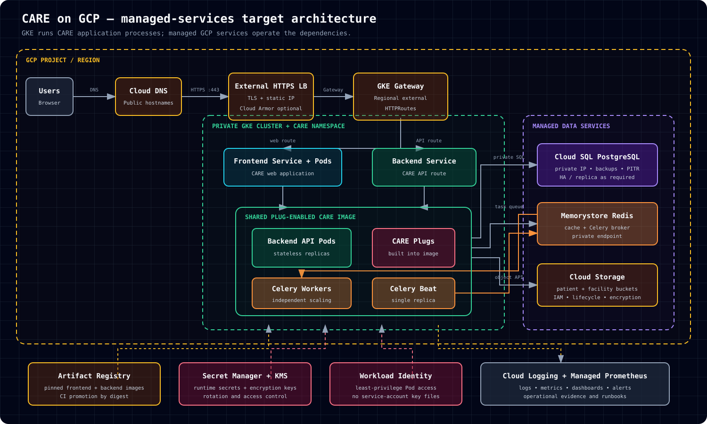

# Recommended managed-services GCP architecture

This design keeps only CARE application processes in GKE and moves durable or operational dependencies to managed GCP services.



## Design goal

The primary workload is CARE:

- CARE frontend
- CARE backend API with plugs
- Celery workers
- Celery Beat

GKE runs and scales those application processes. GCP manages the database, object storage, cache and broker, secrets, encryption, image registry, ingress, logging, and metrics.

## Core request path

```text
Users
  → Cloud DNS
  → External HTTPS Load Balancer
  → GKE Gateway and HTTPRoutes
  → Frontend or Backend Kubernetes Service
  → CARE Pods
```

The frontend and API have separate routes. TLS terminates through the Gateway listener. Cloud Armor can be attached as an optional edge policy.

## CARE workloads in GKE

| Workload | Responsibility | Scaling model |
|---|---|---|
| Frontend | Serves the CARE web application | Multiple replaceable replicas |
| Backend API | Handles synchronous API requests and plug routes | Horizontally scalable replicas |
| Celery workers | Consume asynchronous tasks | Scale independently using queue and resource signals |
| Celery Beat | Runs startup synchronization and schedules tasks | One active replica |

Backend API, workers, and Beat must use the same plug-enabled CARE image.

## Managed dependencies

| CARE dependency | Managed GCP service | Reason |
|---|---|---|
| PostgreSQL | Cloud SQL for PostgreSQL over private IP | Automated backups, PITR, maintenance, replicas, and managed durability |
| Object storage | Google Cloud Storage | Durable patient and facility buckets with IAM, lifecycle policy, and encryption |
| Redis cache and Celery broker | Memorystore for Redis | Managed availability, patching, monitoring, and persistence options |
| Container images | Artifact Registry | Controlled image storage, scanning, and promotion by digest |
| Runtime secrets | Secret Manager delivered through Kubernetes Secrets | Centralized secret ownership and rotation |
| Encryption keys | Cloud KMS | Customer-managed encryption where required |
| Metrics | Managed Service for Prometheus | GKE and application metrics without a separate Prometheus control plane |
| Logs | Cloud Logging | Centralized workload, platform, and request logs |

## Networking and identity

- A VPC contains the GKE, Pod, Service, proxy-only, and private-service-access ranges.
- GKE worker nodes remain private.
- Cloud SQL and Memorystore use private addresses.
- Workload Identity grants Pods narrowly scoped GCP permissions without service-account key files.
- The backend uses a dedicated Kubernetes service account to reach Cloud Storage and other permitted APIs.
- Public exposure is limited to the HTTPS load balancer and Gateway routes.

## Relationship to the current infrastructure repository

The current infrastructure already provides the Gateway/GKE baseline, private Cloud SQL, Cloud Storage, Artifact Registry, KMS, Workload Identity, Managed Prometheus, and Cloud Logging.

The material architectural change in this recommended target is Redis:

```text
Current repository: Redis Helm release inside GKE
Recommended target: Memorystore for Redis over private networking
```

Migrating Redis requires updating the broker/cache endpoints, firewall and private network access, health monitoring, capacity configuration, and a tested cutover plan. It should be implemented separately from the diagram change.

## Optional extensions

Keep optional workloads outside the core teaching path:

- Metabase with its own managed PostgreSQL database
- DICOM services and dedicated Cloud Storage bucket
- CARE metrics exporter using `PodMonitoring`
- Cloud Armor policy
- External wildcard certificate support

Introduce these after participants can trace the core frontend, API, task, database, cache, and storage flows.

## Production checks

Before go-live, verify:

- Gateway routes, certificates, and backend health
- Workload requests, limits, probes, replicas, and disruption policies
- Cloud SQL backups, PITR, availability design, and restore test
- Memorystore sizing, availability, eviction policy, and alerting
- Bucket IAM, lifecycle policy, encryption, and recovery behavior
- Secret rotation and Workload Identity permissions
- Image digest promotion and rollback target
- Logs, metrics, alerts, runbooks, and named operational owners
