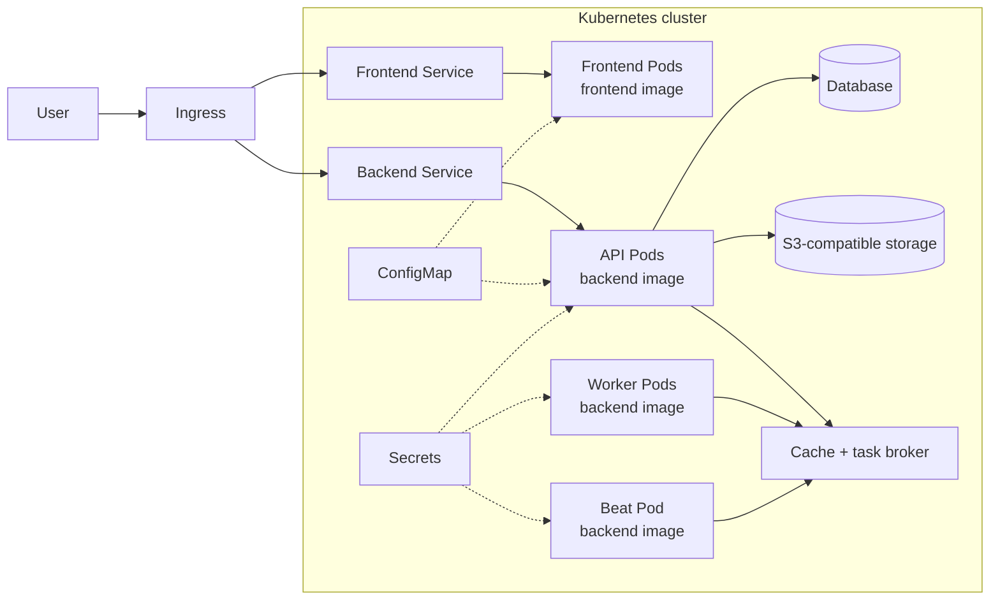

# CARE on a simple Kubernetes cluster

This view introduces the Kubernetes objects used to run the same CARE application model. It is a teaching architecture, not a production deployment template.

## Application images and runtime roles

CARE still has two application images:

| Image | Kubernetes runtime roles |
|---|---|
| Frontend image | Frontend Deployment and Pods |
| Backend image | API Deployment, worker Deployment, and Beat Deployment |

CARE plugs remain installed inside the backend image. They are not independent workloads.

## Kubernetes objects

| Object | Responsibility |
|---|---|
| Ingress | Receives browser traffic and routes it to the frontend or backend Service |
| Service | Gives a stable in-cluster endpoint to replaceable Pods |
| Deployment | Declares and updates the frontend, API, worker, and Beat Pods |
| Secret | Supplies sensitive runtime values to backend roles |
| ConfigMap | Supplies non-secret runtime configuration |
| Persistent storage | Retains state for any dependency operated inside the cluster |

## Startup behavior

Beat waits for the database and task broker, runs migrations and synchronization, becomes healthy, and then starts scheduling tasks. The API and worker wait for the Beat health signal. There is no separate initialization workload.

## Production boundary

A production Kubernetes deployment additionally needs controlled images, resource requests and limits, probes, replica and disruption policies, private networking, managed secrets, observability, backup and restore, and an approved ingress and TLS design.
