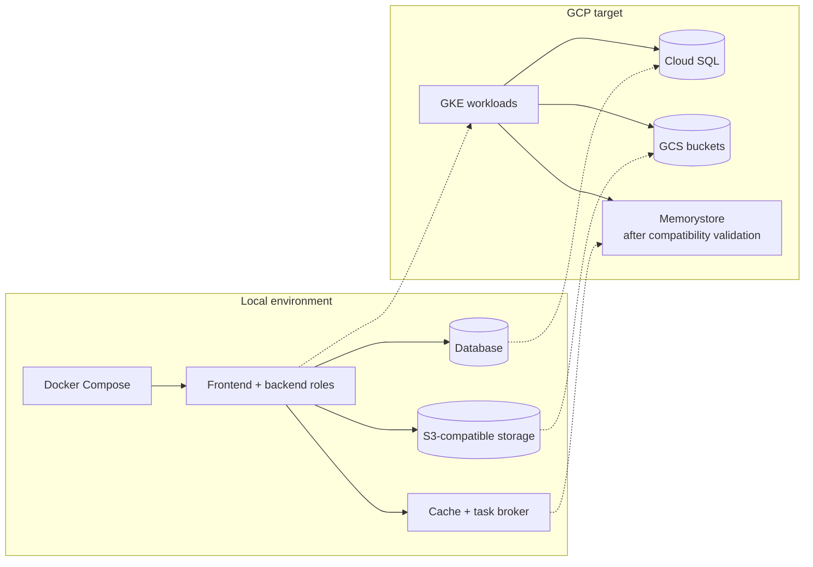
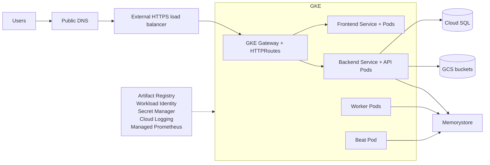

# From local Docker Compose to GCP

The clearest teaching method is to keep the CARE responsibilities unchanged and replace one local platform capability at a time. Participants should recognize the same frontend, backend, worker, Beat, database, cache, storage, and plug roles in both diagrams.



## The central message

The application architecture does not fundamentally change:

```text
Frontend → Backend → data services
Backend and Beat → cache and task broker → Worker
Plugs extend the shared CARE image
```

GCP changes where components run, how users reach them, how identities are assigned, and how state is protected and operated.

## Component mapping

| Local Compose concept | GCP production concept | What participants should learn |
|---|---|---|
| Docker Compose network | VPC, GKE subnet, Pod and Service networking | Production networking is explicit and segmented. |
| `frontend` container | GKE frontend Deployment and Service | The same image runs with replicas, probes, and resource policies. |
| `backend` container | GKE backend Deployment and Service | The API is stateless and can scale horizontally. |
| `worker` container | GKE Celery worker Deployment | Workers scale independently from API pods. |
| `beat` container | Single-replica GKE Beat Deployment | Beat still initializes CARE and schedules tasks; only one active scheduler is required. |
| Backend plugs | Plugs baked into the promoted backend image | API, worker, and Beat must use the same plug-enabled artifact. |
| `db` container | Private Cloud SQL for PostgreSQL | The database becomes managed, durable, backed up, and privately reachable. |
| `redis` container | Memorystore for Redis over private networking | GCP operates the cache and broker while CARE keeps Redis queue and cache semantics. |
| `silo` container | Google Cloud Storage buckets | The S3-compatible local teaching dependency becomes durable object storage. |
| `.env` file | Secret Manager, Kubernetes Secrets, and ConfigMaps | Configuration is separated from images and access is controlled. |
| Frontend and backend image builds | CI build and Artifact Registry | Build, scan, pin, approve, and promote both application images. |
| `localhost` ports | DNS, HTTPS load balancer, GKE Gateway, and HTTPRoutes | Public traffic receives TLS and controlled routing. |
| `docker compose ps/logs` | `kubectl`, Cloud Logging, and Managed Prometheus | Operations become centralized and multi-replica aware. |
| Named volumes | Managed durability, backups, versioning, and restore procedures | Production state needs explicit recovery objectives and tests. |

## Recommended teaching progression

### Step 1 — Prove the local environment

Participants should be able to identify every component, explain the two image boundaries, verify application health, confirm database and object-storage behavior with synthetic data, confirm worker activity, and explain Beat-owned startup initialization.

Do not introduce Kubernetes until these roles are understood.

### Step 2 — Replace processes with Kubernetes workloads

Map each long-running Compose service to a workload:

```text
frontend  → Deployment + Service
backend   → Deployment + Service
worker    → Deployment
beat      → single-replica Deployment
```

Then introduce readiness probes, liveness probes, resource requests and limits, replica counts, autoscaling, and PodDisruptionBudgets. Emphasize that these controls improve operation; they do not change CARE's application responsibilities.

### Step 3 — Replace local state with managed services

Replace one dependency at a time:

```text
Local database        → private Cloud SQL
S3-compatible storage → GCS buckets
Local cache/broker    → Memorystore
```

Discuss private connectivity, credentials, backups, retention, restoration, and failure behavior for each dependency.

### Step 4 — Add the public request path

Build the path from the outside inward:

```text
Public DNS
  → external HTTPS load balancer
  → GKE Gateway
  → HTTPRoute
  → Kubernetes Service
  → frontend or backend Pods
```

Use only the GKE Gateway model. Explain certificates, hostnames, health checks, and routing ownership.

### Step 5 — Add identity, secrets, and artifact promotion

Explain the production control plane around the same runtime:

- Workload Identity assigns cloud permissions without service-account key files.
- Secret Manager is the durable source for secret material.
- Kubernetes Secrets and ConfigMaps deliver runtime configuration.
- Artifact Registry stores approved frontend and backend images.
- CI builds once and promotes immutable image digests through environments.

### Step 6 — Add observability and recovery

Map local inspection to production operation:

| Local action | Production equivalent |
|---|---|
| `docker compose ps` | Deployment, Pod, and Service status |
| `docker compose logs` | Cloud Logging queries |
| Container health check | Readiness/liveness and load-balancer health |
| Local CPU and memory | Managed Prometheus dashboards and alerts |
| `down -v` reset | Controlled restore or environment rebuild procedure |

Finish with backup restoration, rollback, failure drills, and named operational ownership.

## Complete GCP reference architecture



## Suggested transition exercise

Give each group the local architecture diagram and a blank GCP diagram. Ask them to:

1. Place each CARE process into a Kubernetes workload.
2. Replace each local stateful dependency with its GCP counterpart.
3. Draw the public Gateway request path.
4. Assign a cloud identity to each workload that needs GCP access.
5. Identify where configuration and secrets enter the Pods.
6. Add health signals, logs, metrics, backups, and restore evidence.
7. Explain which application responsibilities stayed unchanged.

The goal is not to memorize GCP products. It is to recognize that production architecture wraps the same CARE runtime with managed networking, identity, durability, scaling, observability, and recovery controls.

The complete recommended target is shown in [Managed-services GCP architecture](gcp-managed-architecture.md). The current infrastructure repository deploys the cache and task broker inside GKE; moving that capability to Memorystore requires compatibility validation and a separately tested migration.
