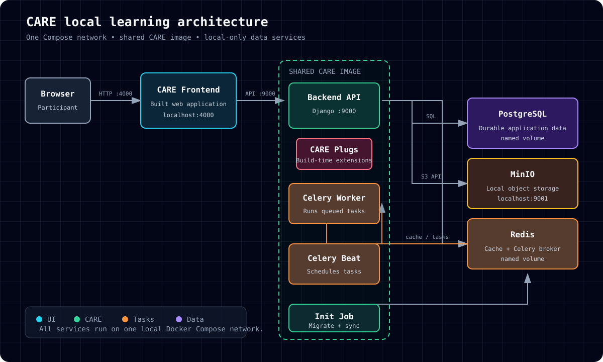
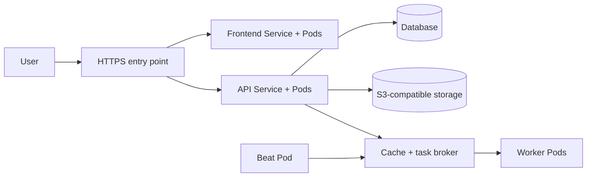
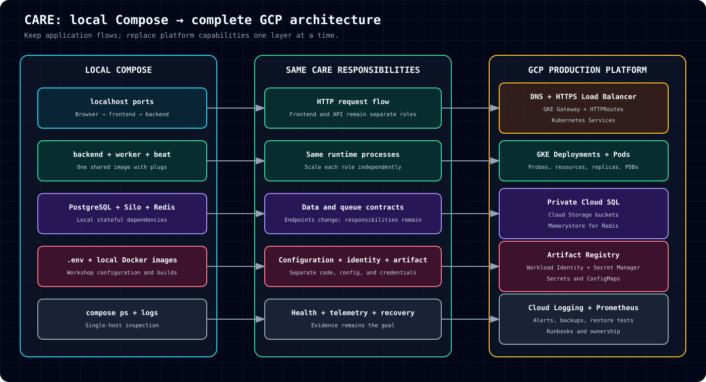
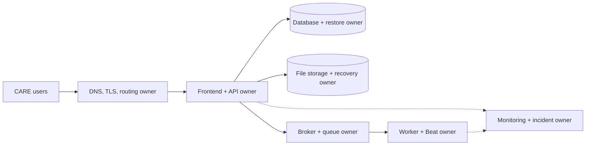

# Host and manage your own CARE instance

## A hands-on operator workshop

Build a safe local instance, verify it, operate it, and design a hosting plan you can own.

**Take home:** a running lab, a verification record, and an owner-assigned hosting and operations plan.

<!-- Presenter notes
Open with the operator's job, not cloud infrastructure. By the end, participants should know what they host, what they manage, how they detect failure, and how they recover.
Ask for a quick show of hands: Who has used CARE? Docker? Kubernetes?
Do not teach Kubernetes terminology yet.
-->

---

# The route we will follow

```text
Understand the components and their owners
      ↓
Build, configure, run, and verify a local instance
      ↓
Practice operations: diagnose, preserve data, recover
      ↓
Choose a hosting model and assign responsibilities
```

You will finish with an evidence-based operator handoff, not just a running container.

<!-- Presenter notes
This is the map for the session. Return to it at each section change.
The final deliverable is one completed operator worksheet and readiness checklist per team.
-->

---

# Start with a person using CARE

A user does not see a database, cache, task broker, workers, or Kubernetes.

They see a web application that can:

- sign them in;
- show and save clinical information;
- upload and retrieve files;
- complete work that may continue in the background.

Our job is to connect that experience to the components that make it work.

<!-- Presenter notes
Use a concrete example: a clinician opens a patient record, saves an encounter, and uploads a document.
Ask: "Which parts must respond immediately, and which work could happen later?"
Transition: reveal the small local architecture behind that experience.
-->

---

# CARE in a local environment



<!-- Presenter notes
Point to the browser first, then introduce each supporting component.
Keep descriptions simple: frontend shows pages; backend applies CARE rules; the database stores records; S3-compatible storage stores files; the cache and task broker carry queued work; workers perform it; Beat initializes CARE and schedules recurring work.
Ask participants to identify the two CARE application images and the supporting dependencies.
-->

---

# Why this workshop uses Docker

CARE can run directly on a host without Docker, but the operator must install, configure, and maintain each required tool and process.

For this workshop, Docker provides:

- repeatable frontend and backend builds;
- isolated dependency services;
- one command to start and stop the environment;
- fewer host-specific setup differences.

Docker is the local delivery choice for this session, not a requirement of CARE itself.

<!-- Presenter notes
Use "local environment" rather than naming one device type. The host could be a workstation, VM, or server.
Without Docker, the same responsibilities remain, but the operator manages language runtimes, database, S3-compatible storage, cache/broker, process startup, and ports directly on the host.
Do not present Docker Compose as the only way to run CARE or as the production architecture.
-->

---

# What each part does

| Part | Plain-language job |
|---|---|
| Frontend | Shows CARE in the browser |
| Backend API | Applies CARE rules and handles requests |
| Database | Stores clinical and application records |
| S3-compatible storage | Stores uploaded files |
| Cache and task broker | Provides caching and carries Celery tasks |
| Celery worker | Performs background jobs |
| Celery Beat | Initializes CARE and schedules recurring jobs |
| CARE plugs | Add features to the shared backend image |

<!-- Presenter notes
Participants need the responsibility of each part, not every implementation detail.
Clarify that the local workshop uses replaceable implementations of these dependencies. The GCP target uses Cloud SQL, GCS buckets, and Memorystore.
Ask: "If the task broker stops, which work is affected?"
-->

---

# CARE has two application images

| Image | Built from | What runs in production |
|---|---|---|
| Frontend | `ohcnetwork/care_fe` | Static HTML, JavaScript, CSS, and Nginx |
| Backend | `ohcnetwork/care` | API, Celery worker, and Celery Beat |

The database, S3 storage, and cache/broker are dependencies. They are not CARE application images.

<!-- Presenter notes
This distinction prevents participants from counting every container as a CARE image.
Say: "We build CARE twice: once for the browser application and once for the server application."
The same backend image runs three process roles.
-->

---

# Frontend settings are fixed at build time

The frontend build reads its `REACT_*` variables before creating the static files.

```bash
REACT_CARE_API_URL=https://api.example.org
REACT_ENABLE_MINIMAL_PATIENT_REGISTRATION=true
```

`REACT_CARE_API_URL` must be the URL that the user’s browser can reach.

Changing a frontend build variable requires a new frontend build.

<!-- Presenter notes
Do not call these React Native variables. CARE frontend is a React web application built with Vite; this project uses REACT_ variable names.
The local workshop uses http://localhost:9000 because the participant's browser sends the API request.
Ask: "Why would http://backend:9000 fail in a user's browser?"
-->

---

# The frontend image serves static files

```text
Node build stage
  └── npm run build
        └── HTML + JavaScript + CSS
                    ↓
Nginx runtime stage
  └── serves the static build on port 80
```

The final frontend image uses Nginx only as the static-file web server.

<!-- Presenter notes
Clarify that Nginx is part of the final frontend image, not a third CARE application image.
After the build, the frontend has no Node application server. It is a set of static files served by Nginx.
Another suitable static web server could serve the same build output.
-->

---

# Backend plugs are installed during the build

The backend build receives `ADDITIONAL_PLUGS` as a build argument.

```bash
ADDITIONAL_PLUGS=[]
```

For a customized deployment, the JSON list identifies the pinned plug packages and their configuration. The build downloads and installs them into the backend image.

Changing the plug list requires a new backend build.

<!-- Presenter notes
Keep the visible example empty so the slide does not invent a plug package.
Explain that plug secrets should not be embedded in the plug list or image. Supply secret values through the runtime secret mechanism.
The image used by API, worker, and Beat must contain the same plugs.
-->

---

# One backend image, three jobs

```text
Shared plug-enabled backend image
  ├── Backend API   receives web requests
  ├── Celery worker runs queued work
  └── Celery Beat   initializes CARE and schedules work
```

Beat waits for the database and task broker, runs migrations and synchronization, becomes healthy, and then starts scheduling tasks.

There is no separate initialization container.

<!-- Presenter notes
Say: "Same backend image and plugs, different process command."
Backend and worker wait for Beat to become healthy so they do not start before initialization finishes.
Ask: "Why would different plug versions in the API and worker be dangerous?"
-->

---

# Lab agreement

Work in pairs:

- **Operator:** runs commands and uses CARE.
- **Verifier:** checks results and records evidence.

Rules:

- Use only synthetic workshop data.
- Use only local demo credentials.
- Do not connect to production services.
- Do not treat this Compose stack as a production design.

Record observations in `docs/operator-worksheet.md`.

<!-- Presenter notes
Assign roles before opening a terminal. Swap roles halfway through if time allows.
Show docs/operator-worksheet.md. The verifier should capture command output or screenshots, not tick boxes from memory.
-->

---

# Prepare the workshop repository

```bash
git clone https://github.com/jesbinjoseph/care-session.git
cd care-session

git clone --depth 1 --branch develop https://github.com/ohcnetwork/care.git
git clone --depth 1 --branch develop https://github.com/ohcnetwork/care_fe.git
test -f .env || cp .env.example .env
cp frontend.env.production.local \
  care_fe/.env.production.local
docker compose config --quiet
```

The browser reaches the local API at `http://localhost:9000`.

<!-- Presenter notes
Ask participants to install Docker and clone repositories before the session if bandwidth is limited.
Explain the three repositories: workshop instructions, backend source, and frontend source.
Expected evidence: both source repositories exist, local configuration is present, and Compose resolves. Never overwrite an existing `.env`.
-->

---

# Read the stack before starting it

```bash
docker compose config --services
```

You should see these exact seven service names:

```text
db
redis
silo
beat
backend
worker
frontend
```

`db`, `redis`, and `silo` implement the workshop's generic database, cache/broker, and S3-compatible storage roles. This check does not start containers.

<!-- Presenter notes
Ask participants to map each literal service name to its responsibility in the architecture diagram.
Plugs do not appear as a service because they are installed inside the backend image.
Expected evidence: seven service names and no Compose configuration error.
-->

---

# Build and start CARE

```bash
docker compose up -d --build --wait
```

What happens:

1. Docker builds two CARE application images from the official frontend and backend repositories.
2. The frontend build reads its `REACT_*` values, including the browser-visible API URL.
3. The backend build installs the configured `ADDITIONAL_PLUGS`.
4. The database, cache and task broker, and S3-compatible storage start.
5. Beat completes migrations and synchronization.
6. Backend and worker start after Beat becomes healthy.
7. Nginx serves the static frontend build.

<!-- Presenter notes
The first build can take time. Start it early or keep a working facilitator machine ready.
While it runs, ask participants to predict the startup order.
Fallback: pair anyone with a failed build to a working machine and continue the learning flow.
-->

---

# Prove the stack is healthy

```bash
docker compose ps -a
curl -f http://localhost:9000/ping/
curl -I http://localhost:4000/
docker compose exec backend python manage.py check
```

Open:

- CARE: `http://localhost:4000`
- API documentation: `http://localhost:9000/swagger/`
- Object-storage console: `http://localhost:9001`

A running container is useful evidence. A working application is better evidence.

<!-- Presenter notes
Record service state, backend ping, frontend HTTP status, and Django check result.
If Beat is unhealthy, inspect Beat logs first because it owns startup initialization.
Do not move on until participants can explain "running" versus "working."
-->

---

# Use CARE with synthetic data

```bash
docker compose exec backend python -m pip install \
  --target /tmp/care-fixtures-deps 'Faker==38.2.0'
docker compose exec -e PYTHONPATH=/tmp/care-fixtures-deps \
  -e 'DJANGO_ALLOWED_HOSTS=["localhost","127.0.0.1","backend","testserver"]' \
  backend python manage.py load_fixtures
```

Then complete one simple journey:

1. Sign in with a fixture account.
2. Open or create a synthetic patient record.
3. Save a basic clinical workflow.
4. Upload and retrieve a test document.

Faker is a development-only dependency installed temporarily for this local exercise. Never enter real patient data in the workshop environment.

<!-- Presenter notes
Keep this short. The objective is deployment validation, not feature training.
Ask the verifier which action proves database access and which proves object storage.
-->

---

# Use a small failure drill

Choose one prepared, safe failure.

Troubleshoot in this order:

1. Is the service running and healthy?
2. Is the endpoint reachable?
3. Can the backend reach its dependency by service name?
4. Is the configuration present and correctly typed?
5. What do the relevant logs say?

Record the symptom, evidence, cause, and fix.

<!-- Presenter notes
Use a prepared failure so the exercise stays time-bounded. Do not improvise destructive changes.
Examples: an incorrect local URL or a deliberately incorrect configuration on the facilitator machine.
The goal is a repeatable diagnostic order, not solving every Docker problem.
-->

---

# Practice a daily operator check

| Check | If it fails, first action |
|---|---|
| Browser and API respond | Check service state, then backend/frontend logs |
| Beat initialized; worker is running | Inspect Beat, then broker and worker logs |
| Synthetic record and test file can be read | Check database and object storage independently |
| Queue is not aging; free capacity is sufficient | Assign an owner and investigate before users report a failure |

Record the time, result, and person responsible. A green container status cannot replace an application check.

<!-- Presenter notes
Ask each pair to perform the first two checks now; the latter two require application activity or metrics. If not tested, record unknown. For a real instance, define frequencies, thresholds, alert routing, and a runbook.
-->

---

# Plan a safe change and a recovery

```text
Pin two images → test with synthetic data → approve → deploy → verify
       ↓                    ↓                        ↓
   plug set          backup and restore         rollback target
```

Write down who applies migrations (Beat at startup), who monitors the release, when to roll back, and who restores the database **and** uploaded files if needed.

<!-- Presenter notes
This is a planning exercise, not permission to experiment with a real instance. A code rollback cannot always undo a schema or data migration. Require an isolated restore test before making recovery promises.
-->

---

# Keep a record of what you proved

Each pair should now have evidence that:

- all seven services resolved and started;
- Beat completed initialization;
- frontend and API responded;
- Django passed its system check;
- a synthetic workflow reached the database;
- a test file reached S3-compatible storage;
- a background task reached a worker, if one was triggered;
- stop and restart preserve local data, after testing it.

<!-- Presenter notes
Pause and update the operator worksheet now. Do not mark task processing or data persistence as passed unless actually tested.
If an item is untested, mark it unknown. Unknown is not the same as passed.
Transition: "A running lab is the start of operating CARE, not the end."
-->

---

# Compose teaches the roles, not a hosting prescription

| Local lab | Your own instance must decide |
|---|---|
| One Docker host | Workstation, VM, server, or cluster; capacity and maintenance owner |
| Database, file store, cache/broker containers | Self-managed or compatible managed dependencies; backups and access |
| Two locally built CARE images | Pinned frontend and backend artifacts; promotion and rollback |
| Local demo configuration | Separate environments, secrets and browser-reachable URLs |
| Published local ports | DNS, HTTPS, network boundaries and routing |
| Terminal logs | Monitoring, alerts, on-call ownership and recovery |

The responsibilities do not disappear when a provider manages some of them.

<!-- Presenter notes
Avoid presenting Compose as a small production installation. Ask the team who owns each responsibility in their own hosting model. A managed service still needs configuration, evidence, and an owner.
-->

---

# Kubernetes is one possible hosting model



Kubernetes adds Services, Pods, configuration, secrets, health checks, and controlled replicas. CARE still uses two application images. The frontend API URL belongs to the **image build**, not a runtime ConfigMap.

<!-- Presenter notes
Use this only if the participants are considering Kubernetes. Introduce Services, Pods, Secrets, and runtime configuration. Do not suggest this template is deployable as-is.
API, worker, and Beat remain separate runtime roles using the same backend image. Beat still owns startup initialization.
This is a teaching architecture, not a production deployment template.
-->

---

# One platform example: local roles to GCP



<!-- Presenter notes
Use this as an example, not the prescribed destination. Ask participants to map the same roles to their own provider or self-managed platform. Cloud SQL and GCS require CARE configuration and integration checks; validate a managed broker against Celery before selecting it.
-->

---

# Name the operator for each responsibility



An instance is manageable only when each box has a named operator and a way to verify it works.

<!-- Presenter notes
Use the team's operator worksheet to assign owners and evidence. One person may own several roles, but none can be assumed away. The diagram deliberately avoids disclosing any current production environment.
-->

---

# GCP is an example, not a requirement


<!-- Presenter notes
Only show this if useful to the audience. Cloud SQL, GCS, and a compatible managed broker are choices to test, not automatic drop-in substitutions. Ask how each role would be run on the participants' chosen platform.
-->

---

# Size from evidence, not facility labels

Ask these questions first:

- How many people use CARE at the busiest time?
- How many facilities and integrations are in scope?
- How many records, files, and images arrive each day?
- Which plugs and background tasks are enabled?
- How quickly must the service recover?
- What did load tests and pilot telemetry show?

"PHC" and "district" are planning context, not machine sizes.

<!-- Presenter notes
Invite example workload assumptions from participants.
Separate starting estimates from production evidence. Do not offer universal CPU or memory numbers without a validated workload profile.
-->

---

# Separate every environment and its data

| Environment | Purpose | Data | Change pace |
|---|---|---|---|
| Development | Fast engineering feedback | Synthetic | Frequent |
| Staging | Release and integration checks | Synthetic | Controlled |
| Production | Live service delivery | Protected live data | Approved and auditable |

Separate credentials, identities, databases, buckets, hostnames, configuration, approvals, and alerts.

<!-- Presenter notes
Use one example: a staging migration must not touch the production database.
Ask: "What happens if development and production share an object-storage bucket?"
-->

---

# Plugs move with the CARE release

```text
Select → Pin → Build → Test → Promote → Verify → Monitor
```

For each plug, record:

- owner and pinned version;
- required configuration and secrets;
- database and data-access impact;
- resource requirements;
- staging evidence;
- rollback trigger and procedure.

API, worker, and Beat must run the same plug-enabled image.

<!-- Presenter notes
Show ADDITIONAL_PLUGS, but do not expose secrets.
Changing plugs creates a new backend image. It is not an interactive production installation.
Connect this back to the shared-image slide.
-->

---

# Promote two tested application images

```text
Frontend source + build environment → frontend image digest
Backend source + plug list         → backend image digest
                                      ↓
                           Development → Staging → Production
```

Record both image digests, the frontend build environment, backend plug set, runtime configuration version, migration status, test evidence, approver, and rollback target.

<!-- Presenter notes
Explain "build once" plainly: production receives the exact two images tested in staging.
Frontend API URL changes and backend plug changes both require new image builds. Avoid floating image tags for controlled releases.
Ask what evidence participants need before approving the production arrow.
-->

---

# Operate what users depend on

| Question | Useful evidence |
|---|---|
| Can users reach CARE? | Gateway and application availability |
| Is CARE responding normally? | Request latency and error rate |
| Are background jobs moving? | Queue depth, oldest task, failures |
| Can data services keep up? | Database, file storage, and broker metrics |
| Can operators act? | Alert owner, notification path, and runbook |

Choose a logging and metrics system your operators will actually monitor; record alert thresholds and owners.

<!-- Presenter notes
Choose one failure, such as a growing Celery queue. Ask what metric reveals it, who receives the alert, and what the runbook says.
Do not list dashboards without explaining the question each one answers.
-->

---

# Protect access and data

Minimum production controls:

- private data-service endpoints and restricted network access;
- workload identities instead of long-lived key files where supported;
- least-privilege identities for each workload;
- managed secrets with a tested rotation process;
- TLS for public and database connections;
- pinned and scanned container images;
- restricted administration and audit logs.

A control is complete only after the team tests it.

<!-- Presenter notes
Give one concrete test per control. Example: prove a workload without the storage role cannot read a bucket.
Keep this focused on operating CARE, not general cloud-security theory.
-->

---

# Recovery must be demonstrated

Plan and test recovery from:

- a failed release;
- database interruption or corruption;
- deleted or unavailable files;
- cache or task-broker loss;
- certificate expiry;
- failed secret rotation.

Record the last successful restore, measured recovery time, recovered point, application validation, and named owner.

A backup configuration is not proof that CARE can be restored.

<!-- Presenter notes
Ask: "When was the last restore test, and did anyone open CARE afterward?"
Connect recovery evidence directly to the final go/no-go decision.
-->

---

# Turn field problems into readiness questions

| Situation | Ask before go-live |
|---|---|
| Unstable connectivity | Who detects it, and what is the escalation path? |
| Storage growth | Which alert fires before writes fail? |
| Queue saturation | Can operators see task age and scale safely? |
| Failed release | What triggers rollback, and is the previous image available? |
| Backup failure | When was restoration last tested? |
| Site power interruption | What equipment and local procedure keep work safe? |

<!-- Presenter notes
Give each pair one row. Ask them for user impact, evidence, owner, and response.
Debrief two examples before moving to the readiness decision.
-->

---

# The deployment readiness gate

A deployment needs evidence for:

1. scope and workload assumptions;
2. DNS, TLS, database, cache, storage, and integrations;
3. pinned deployment and functional tests;
4. security and identity controls;
5. logs, metrics, alerts, owners, and runbooks;
6. backup restoration and rollback;
7. operational and escalation ownership.

Use `docs/operator-worksheet.md` to name operators and record lab results; use `docs/readiness-checklist.md` for separate real-deployment evidence.

<!-- Presenter notes
Update the checklist with links, outputs, or screenshots.
Local lab evidence proves the application model. Production gates need separate platform evidence.
Do not allow an unchecked critical item to disappear into meeting notes.
-->

---

# Decide: go, conditional go, or no-go

## Go

All critical gates have evidence. Recovery, rollback, operators, and pilot scope are ready.

## Conditional go

No patient-safety or data-protection blocker remains. Exceptions are time-bound, owned, and formally accepted.

## No-go

A critical dependency, security control, recovery path, or accountable owner is missing.

**Unknown is not green.**

<!-- Presenter notes
Timebox the decision to five minutes.
Each pair states the decision, strongest evidence, and most important open risk.
Challenge unsupported "go" decisions by asking for the exact evidence.
-->

---

# What participants can now do

```text
Host a lab instance
Build two CARE images; run API, worker, Beat, frontend, and dependencies
Manage it
Check health, inspect logs, preserve data, plan release and recovery
Plan your own hosting
Select and verify compatible dependencies, controls, and named owners
```

The session deliverable is the completed operator worksheet, with a readiness decision backed by evidence.

<!-- Presenter notes
Return to the route from slide 2 and mark each stage complete.
Invite one participant to explain CARE without product jargon, then ask another to name the operator for each dependency.
Close with the next action: resolve every unknown critical checklist item before deployment approval.
-->

---

# Preserve lab data when you stop

Stop while preserving data:

```bash
docker compose down
```

Start again:

```bash
docker compose up -d --wait
```

Do **not** run `docker compose down -v` in this exercise. It would permanently remove the local database, cache data, and object-storage volume. Explain the difference before anyone operates an instance.

<!-- Presenter notes
Have participants reopen a synthetic record and file after restart. Require explicit approval for any destructive reset outside the exercise.
-->

---

# Appendix: first troubleshooting commands

```bash
docker compose ps -a
docker compose logs --tail=200 beat
docker compose logs --tail=200 backend
docker compose logs --tail=200 worker
docker compose config
```

Check dependencies in this order:

```text
database → cache/broker → S3 storage → Beat → backend → worker → frontend
```

<!-- Presenter notes
Beat comes before backend and worker because it performs initialization and exposes the health signal they wait for.
Keep detailed troubleshooting in the companion repository.
-->

---

# Appendix: workshop resources

- Workshop repository: https://github.com/jesbinjoseph/care-session
- Local architecture: https://github.com/jesbinjoseph/care-session/blob/main/docs/architecture.svg
- Simple Kubernetes architecture: https://github.com/jesbinjoseph/care-session/blob/main/docs/kubernetes-local-architecture.md
- Local-to-GCP guide: https://github.com/jesbinjoseph/care-session/blob/main/docs/local-to-gcp.md
- Current OpenTofu-managed GCP architecture: https://github.com/jesbinjoseph/care-session/blob/main/docs/gcp-current-architecture.md
- Managed GCP architecture: https://github.com/jesbinjoseph/care-session/blob/main/docs/gcp-managed-architecture.md
- Facilitator guide: https://github.com/jesbinjoseph/care-session/blob/main/docs/facilitator-guide.md
- Readiness checklist: https://github.com/jesbinjoseph/care-session/blob/main/docs/readiness-checklist.md

<!-- Presenter notes
Share the repository link before ending. The repository owns executable commands; the presentation explains the learning path.
-->
